# 05-blog-from-contentful

In this sample we will create a blog using Contentful to store data.

We will start from previous example `04-blog-from-md`:

```bash
npm install
```

- Next step is moves all data to [Contentful](https://www.contentful.com/). This is a CSM to create, manage and dstribute content.

- First, we need to create an account and remove example project.

- Add new space (we have two spaces for free):

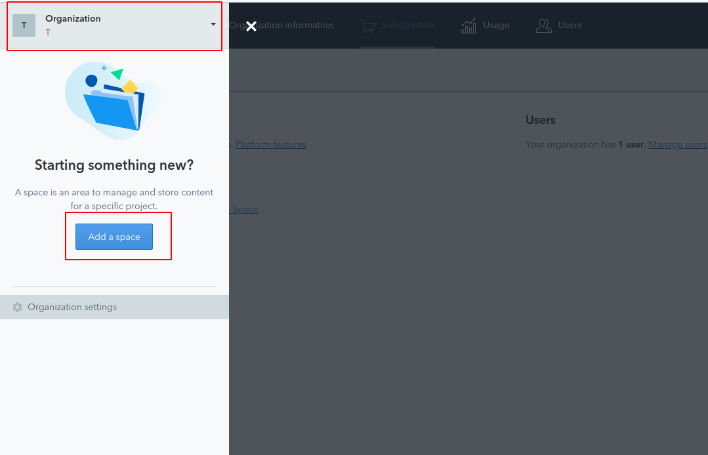

- After that, we'll create a `Post` as content model:

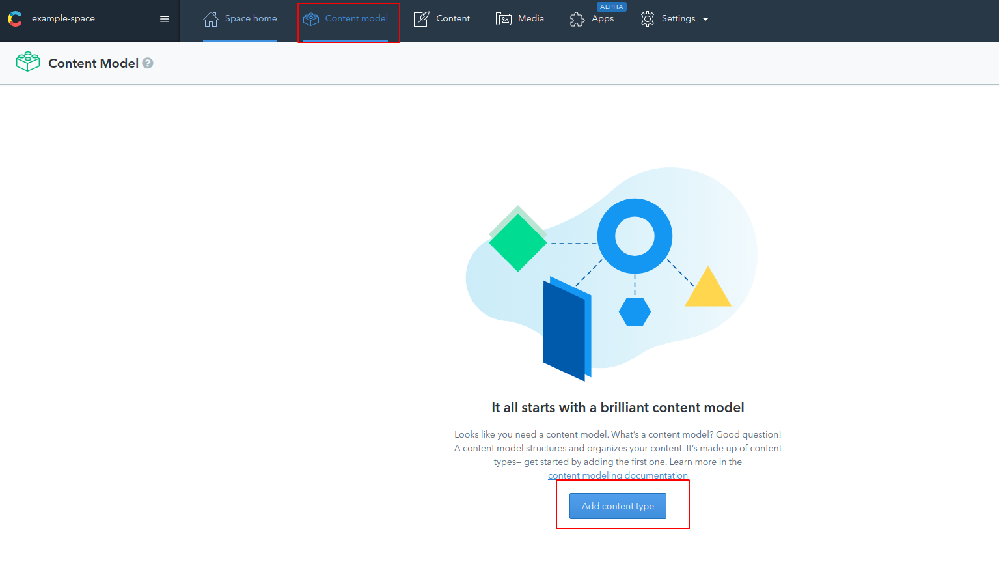

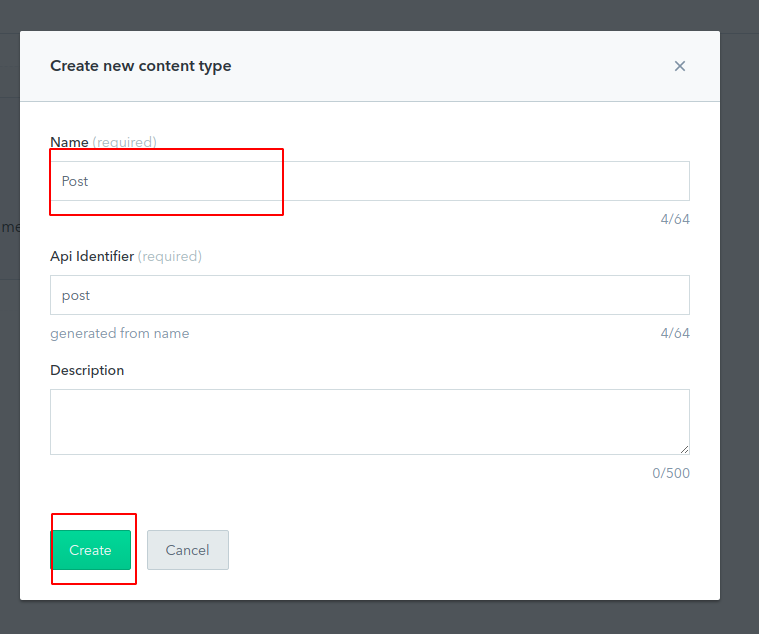

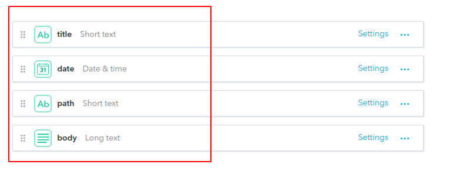

> NOTES:
> Select Date only for date in appearance.
> Body is a Text field type but selecting long type option.

- We can add validations to these fields too, it used for validate data when an developer o content manager fill content. We will set all data as required and path with custom validation too:

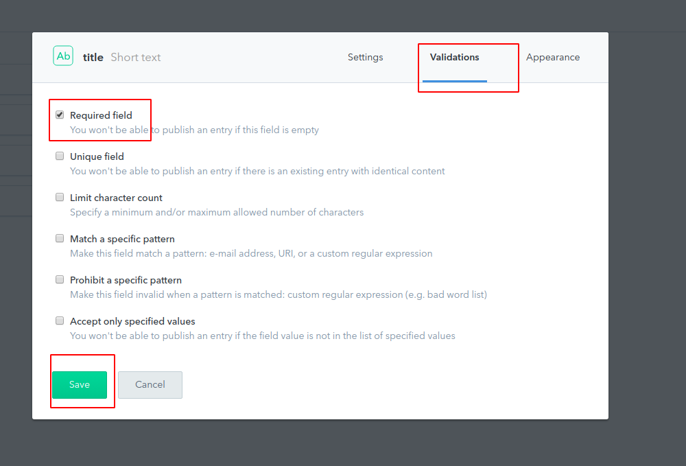

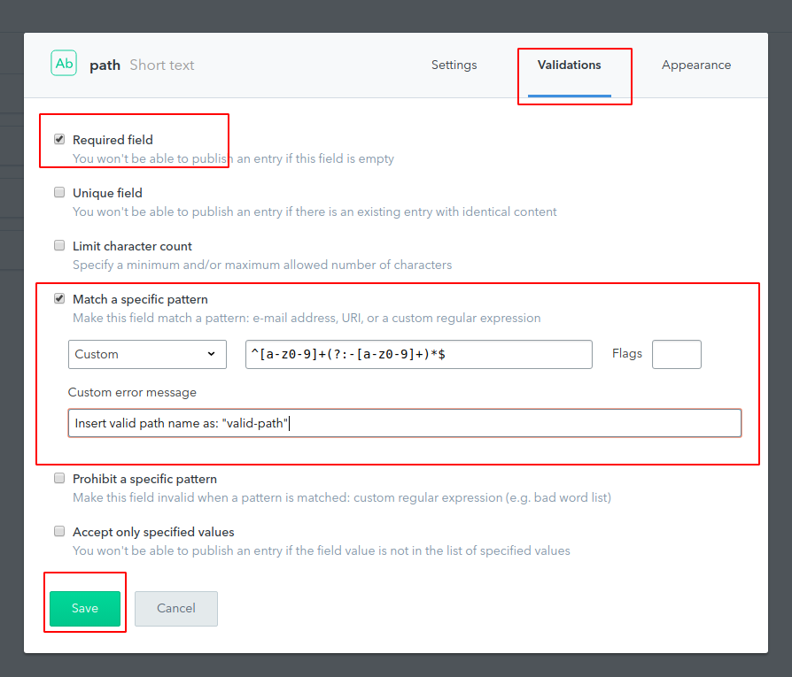

- It's important to save changes after that:


- Now, we are ready to fill content:

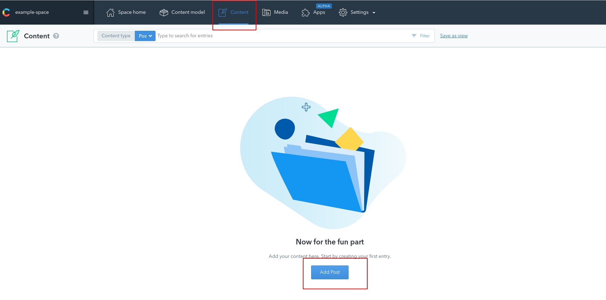

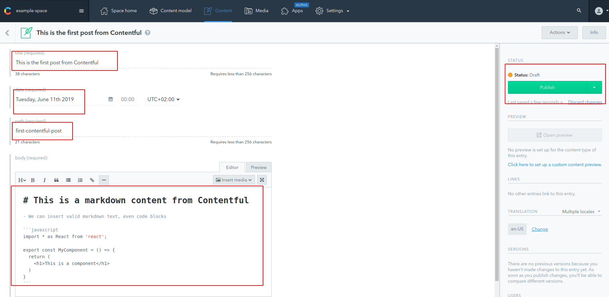

- We can add `media` files in Contentful and attach it to the post:

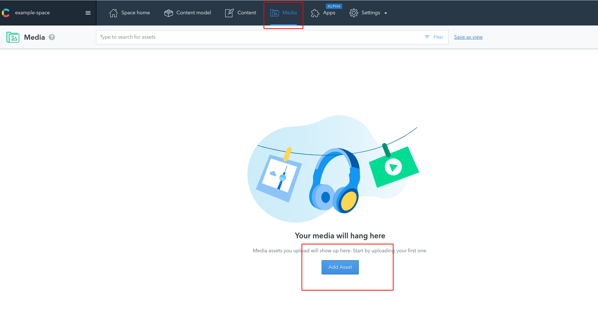

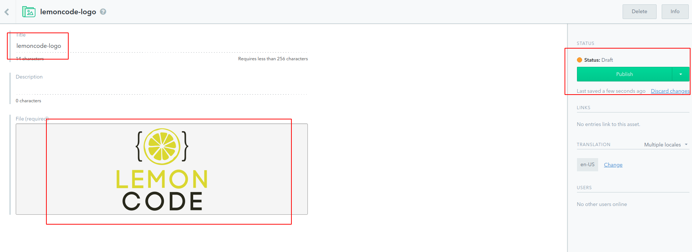

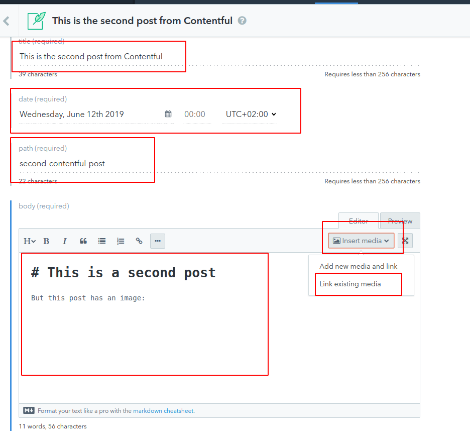

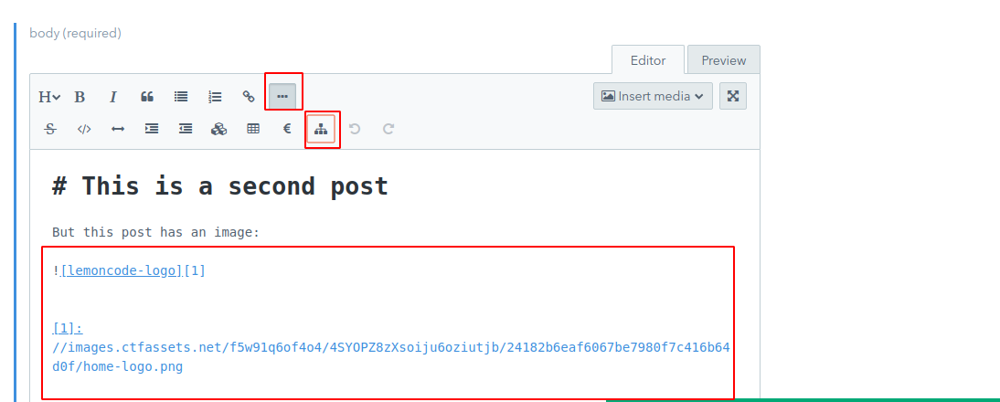

- We need get `space-id` and `access-token` from this Contentful space from settings:

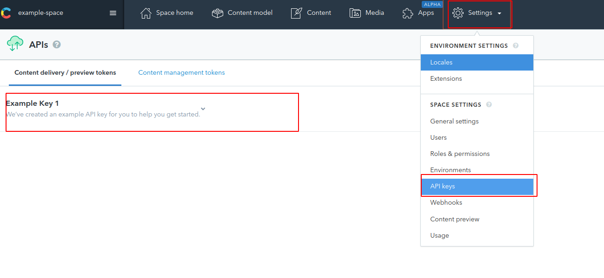

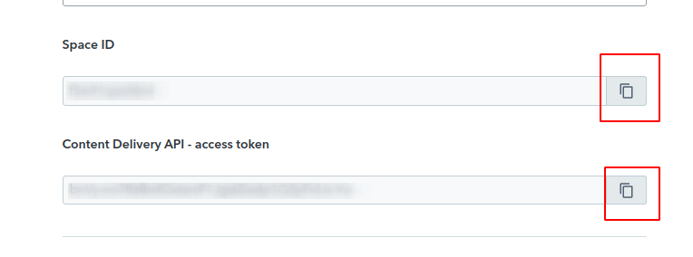

- Add them to `.env` file inside our project:

### ./.env

```
CONTENTFUL_SPACE_ID="spaceId"
CONTENTFUL_ACCESS_TOKEN="accessToken"

```

- Now, it's time to refactor our app to connect it with Contentful:

```bash
npm i gatsby-source-contentful gatsby-remark-images-contentful -P
```

- Update `gatsby-config`:

### ./gatsby-config.js

```diff
+ require('dotenv').config();
const path = require('path');

module.exports = {
  ...
  plugins: [
    ...
-   'gatsby-transformer-remark',
+   {
+     resolve: 'gatsby-transformer-remark',
+     options: {
+       plugins: [
+         {
+           resolve: 'gatsby-remark-images-contentful',
+         },
+       ],
+     },
+   },
    {
      resolve: 'gatsby-source-filesystem',
      options: {
        name: 'posts',
        path: path.resolve(__dirname, 'src/common-app/mock-posts'),
      },
    },
+   {
+     resolve: 'gatsby-source-contentful',
+     options: {
+       spaceId: process.env.CONTENTFUL_SPACE_ID,
+       accessToken: process.env.CONTENTFUL_ACCESS_TOKEN,
+     },
+   },
  ],
};

```

- Run app:

```bash
npm start
```

- Take a look to GraphQL server. Now we have `contentfulPost`:

```graphql
query {
  postListQuery: allContentfulPost {
    nodes {
      title
      date
      path
      body {
        childMarkdownRemark {
          html
        }
      }
    }
  }
}

```

- Update `gatsby-node` to retrieve contentful posts:

### ./gatsby-node.js

```diff
const { resolve } = require('path');

const query = `
query {
- postListQuery: allMarkdownRemark {
+ postListQuery: allContentfulPost {
    nodes {
-     frontmatter {
        path
-     }
    }
  }
}
`;

exports.createPages = async ({ graphql, actions }) => {
  const { createPage } = actions;
  const { data } = await graphql(query);
  const { postListQuery } = data;

  postListQuery.nodes.forEach(node => {
-   const { path } = node.frontmatter;
+   const { path } = node;
    if (path) {
      createPage({
        path,
        component: resolve(__dirname, 'src/pods/post/post.template.tsx'),
        context: {
          slug: path,
        },
      });
    }
  });
};

```

- Update `post.template` too:

### ./src/pods/post/post.template.tsx

```diff
import * as React from 'react';
import { graphql } from 'gatsby';
import { SEO } from 'common/components';
import { AppLayout } from 'layout';
import { Post } from './post.component';

export const query = graphql`
  query($slug: String) {
-   post: markdownRemark(frontmatter: { path: { eq: $slug } }) {
+   post: contentfulPost(path: { eq: $slug }) {
-     frontmatter {
      title
      date
-     }
+     body {
+       childMarkdownRemark {
          html
+       }
+     }
    }
  }
`;

...

const PostTemplate: React.StatelessComponent<Props> = ({
  pageContext: { slug },
  data: {
    post: {
-     frontmatter: { title, date },
+     title,
+     date,
-     html,
+     body: {
+       childMarkdownRemark: { html },
+     },
    },
  },
}) => {
...

```

- And finally, `blog` component:

### ./src/pods/blog/blog.component.tsx

```diff
import * as React from 'react';
import { Link, StaticQuery, graphql } from 'gatsby';
import * as s from './blog.styles';
const PostTitle = s.PostTitle.withComponent(Link);

const query = graphql`
  query {
-   postListQuery: allMarkdownRemark(
+   postListQuery: allContentfulPost(
-     sort: { fields: frontmatter___date, order: ASC }
+     sort: { fields: date, order: ASC }
    ) {
      nodes {
-       frontmatter {
        title
        path
-       }
      }
    }
  }
`;

export const Blog: React.FunctionComponent = () => (
  <StaticQuery
    query={query}
    render={({ postListQuery }) => (
      <s.Container>
        <s.Title>Blog Page</s.Title>
        <s.Posts>
          {postListQuery.nodes.map(node => (
-           <PostTitle to={node.frontmatter.path} key={node.frontmatter.title}>
+           <PostTitle to={node.path} key={node.title}>
-             {node.frontmatter.title}
+             {node.title}
            </PostTitle>
          ))}
        </s.Posts>
      </s.Container>
    )}
  />
);

```

- Stop and run app again:

```bash
npm start
```

- We can give some styles to code blocks using [PrismJS](https://github.com/PrismJS/prism):

```bash
npm i prismjs gatsby-remark-prismjs -P
```

- Update `gatsby-config`:

### ./gatsby-config.js

```diff
...
  plugins: [
    ...
    {
      resolve: 'gatsby-transformer-remark',
      options: {
        plugins: [
          {
            resolve: 'gatsby-remark-images-contentful',
          },
+         {
+           resolve: 'gatsby-remark-prismjs',
+         },
        ],
      },
    },
    ...
  ],
};

```

- How to select a `prismjs` theme in Gatsby? We have to use it in `gatsby-browser.js` file:

> NOTE: [Gatsby lifecycle](https://medium.com/narative/understanding-gatsbys-lifecycle-31c473ba2f2d)
> [`gatsby-config.js`](https://www.gatsbyjs.org/docs/gatsby-config/): configure plugins, metadata, etc.
> [`gatsby-node.js`](https://www.gatsbyjs.org/docs/node-apis/): create pages, update webpack or babel config, that is, add config on build time 
> [`gatsby-browser.js`](https://www.gatsbyjs.org/docs/browser-apis/): add configuration after initial load, for example, route updates, service worker updates, scroll positioning.

### ./gatsby-browser.js

```javascript
require('prismjs/themes/prism-tomorrow.css');

```

# About Basefactor + Lemoncode

We are an innovating team of Javascript experts, passionate about turning your ideas into robust products.

[Basefactor, consultancy by Lemoncode](http://www.basefactor.com) provides consultancy and coaching services.

[Lemoncode](http://lemoncode.net/services/en/#en-home) provides training services.

For the LATAM/Spanish audience we are running an Online Front End Master degree, more info: http://lemoncode.net/master-frontend
