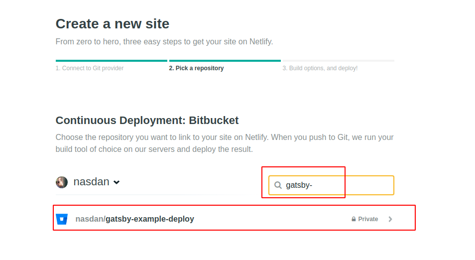
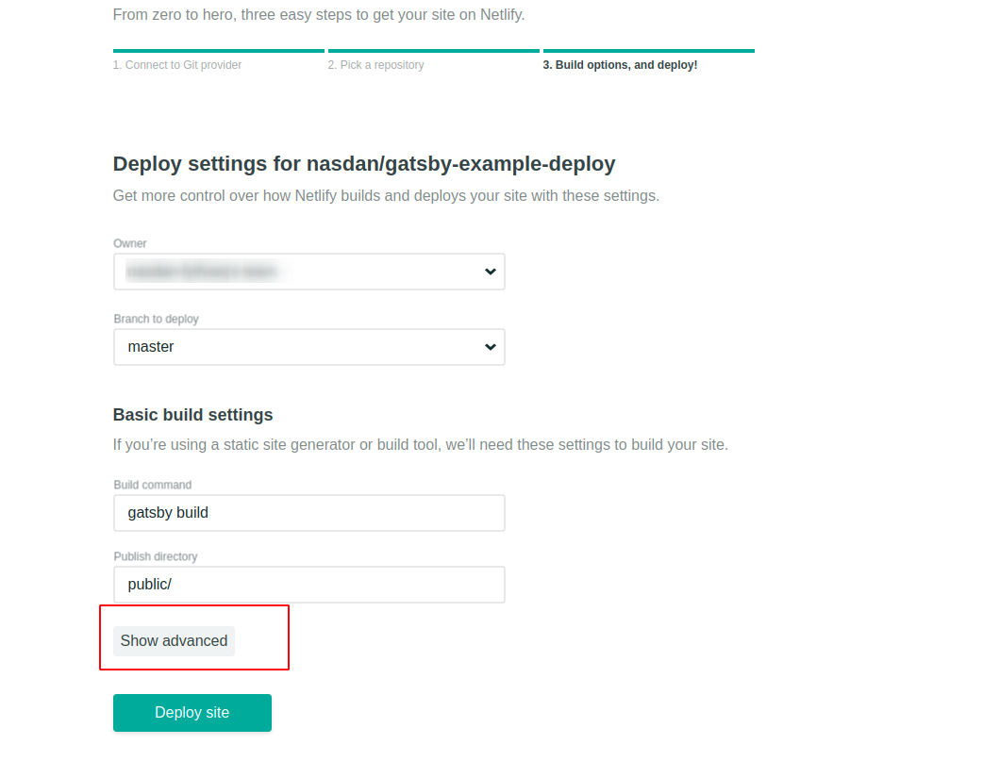
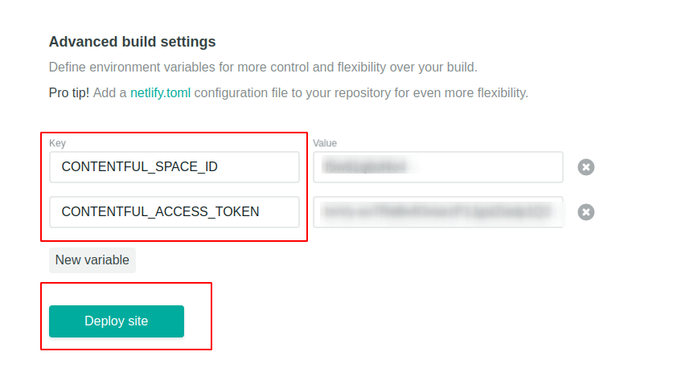
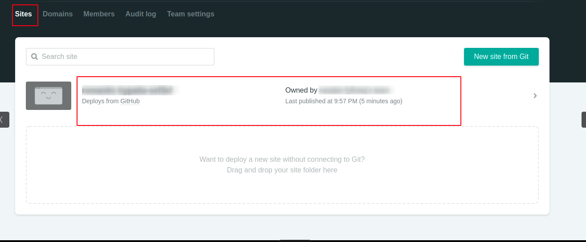
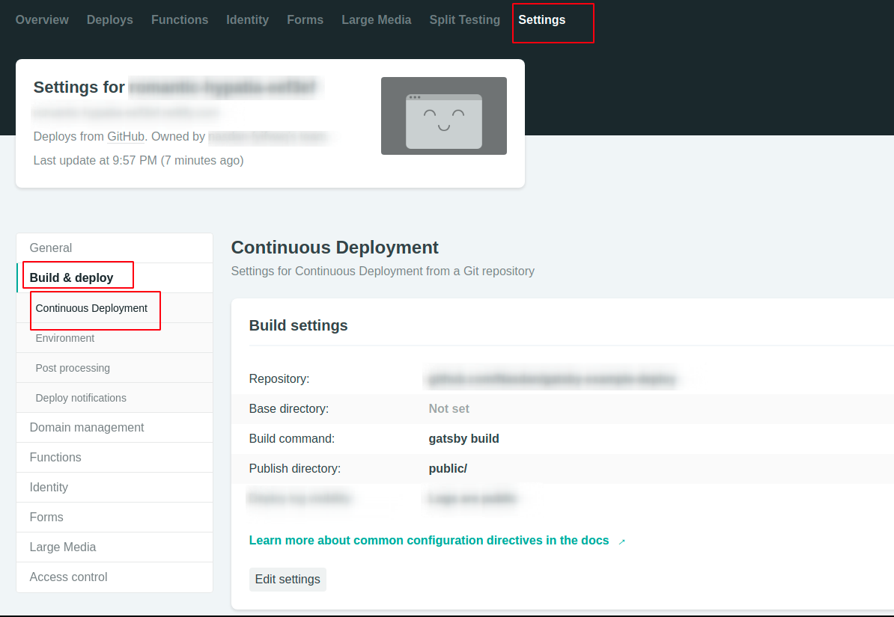
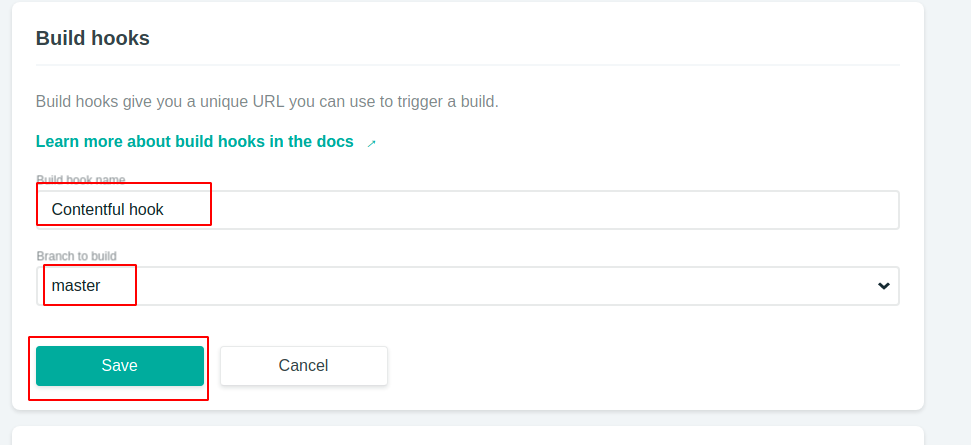
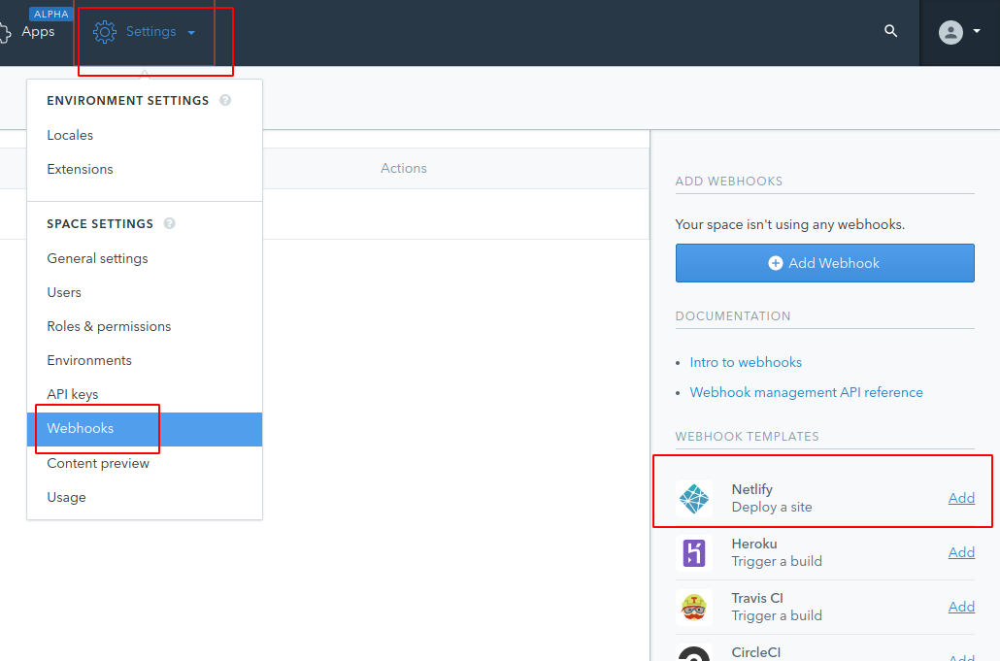
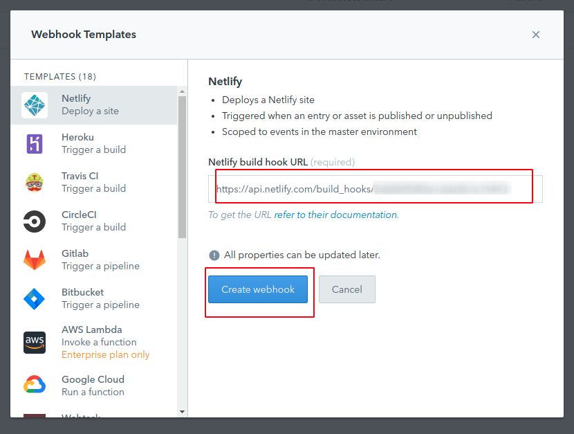
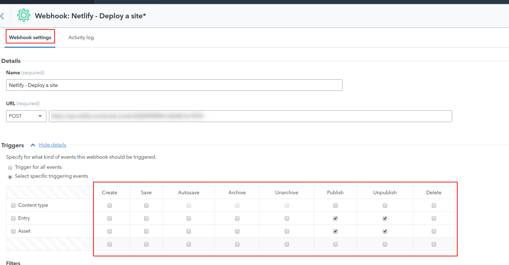

# 06-deploy-to-netlify

In this sample we will deploy this app to Netlify.

We will start from previous example `05-blog-from-contentful`:

```bash
npm install
```

- First, we need to upload this app to a repository.

- Create an account in [Netlify](https://www.netlify.com/).

- Connect Netlify with repository:


- Select repository:



- Show advance settings, add env variables and deploy site:






- Now site is deployed. We can see that we can access to `https` site, so we have SSL for free.

- Some other features:
  - Set up a custom domain.
  - Collect data from a `form` element.
  - Add `build hooks`.

- We can see an example how to configure a `build hook` to run a deploy when some content change in Contentful:





- Add `build hook`:




- Configure web hook in Contentful:





- Finally we can update the `triggers`:



# About Basefactor + Lemoncode

We are an innovating team of Javascript experts, passionate about turning your ideas into robust products.

[Basefactor, consultancy by Lemoncode](http://www.basefactor.com) provides consultancy and coaching services.

[Lemoncode](http://lemoncode.net/services/en/#en-home) provides training services.

For the LATAM/Spanish audience we are running an Online Front End Master degree, more info: http://lemoncode.net/master-frontend
